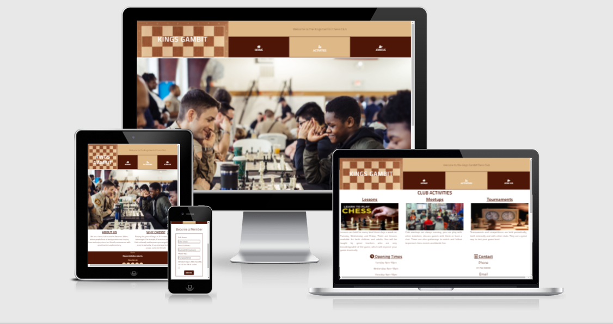
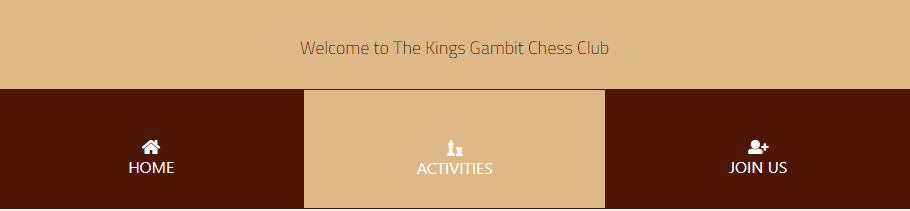
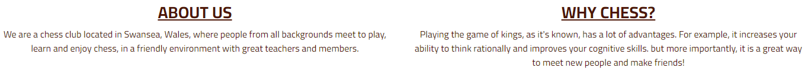
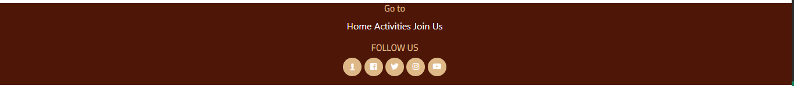
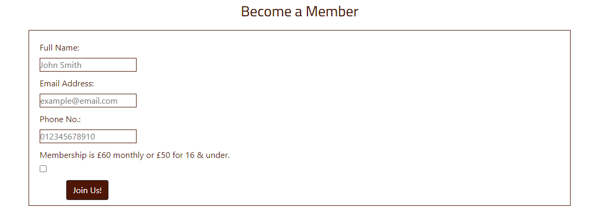
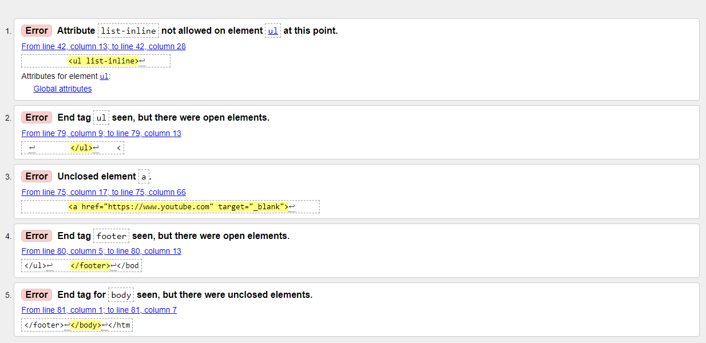

# Kings Gambit
This is a website for the Kings Gambit chess club. It offers information about the club and its activities and it invites people who are interested in the game of chess to become members of the club.

# UXD
## User Stories
### The Club
1. Advertising the club.
2. Inform users about club activities.
3. Encourage users to join the club.
4. Offer users method to contact the club.

### The User
1. Get information about the club.
2. Get contact informations and address.
3. Learn about the club activities.
4. Become a member.

# Features
## Existing Features
### Navigation Bar

* It is on all pages of the website.
* It has links to the Home, Activities and Join Us pages.
* It helps users to go arround the website.

### Landing Page Image

### About Us 

Contains information about the club and why should you play the game of chess.

### Footer

* It is featured across all pages.
* Like the navigation bar it contains links to the Home, Activities and Join Us pages to help the user.
* It also contains links to social media sites and chess.com for users to follow the club.

### Activities Page

* Describes some of the club activities such as lessons, meetups and tournaments.
* Show opening times.
* Gives contact information.

### Join Us Page

* It features a form used to collect informations from users to register them.

### Submit page
It shows the user a message after the join us form is submited.

## Future Features

### Events
* Shows results of tournaments and competitions held in the club.
* Features news of chess worldwide.
# Typography and Color Scheme

* Using [Google Fonts](https://fonts.google.com/) the website uses "Cairo" font as the main font and "sans-serif" as a backup font.

## Color Scheme 

*  `#4d1606`
*  `#deb887`
*  `#ffffff`

# Testing
* Testing has been performed to ensure all the features are working properly.

## Validator test
### HTML
* Using [W3validator](https://validator.w3.org/nu/)

* These errors were found using the validator and have been resovled.

### CSS
* Using [Jigsaw](https://jigsaw.w3.org/css-validator/)
No errors were found.

## Unresolved Bugs
* The logo renders in two lines when the website is used in a tablet.

# Deployment
The website has been deployed using Github pages. 
* Go to the Github repository.
* Click on Settings Tab.
* Click on Pages.
* In Source choose Main. 
* Click Save.
* Live link https://itisahmedh.github.io/chess-club/ 

# Credits
* Icons are from [Fontawsome](https://fontawesome.com/).
* The map is from [Googlemaps](https://maps.google.com/).
* [AmIResponsive](http://ami.responsivedesign.is/) used to create picture of the website across different devices.
* Logo background is from [wikimedia](https://upload.wikimedia.org/wikipedia/commons/d/d5/Chess_Board.svg).
* Landing page image is from [StLuisChessClub](https://www.linkedin.com/company/chess-club-and-scholastic-center-of-saint-louis/?originalSubdomain=de)
* Activities page images are from
[StLuisChessClub](https://saintlouischessclub.org/education/chess-summer-camp),
[wikipedia](https://en.wikipedia.org/wiki/Chess_clock#/media/File:Schachuhr_mechanisch.jpg) and,
[apalmachess](https://www.lapalmachess.com/LPCC/contact/lessons.html).
